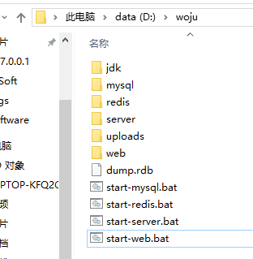
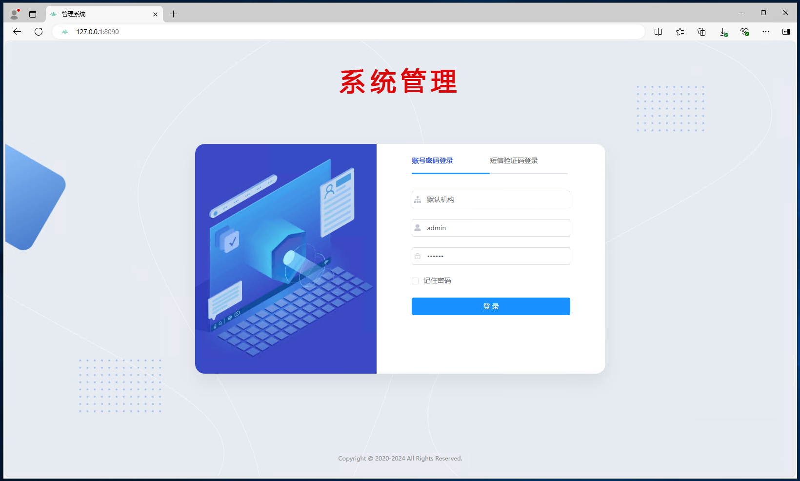
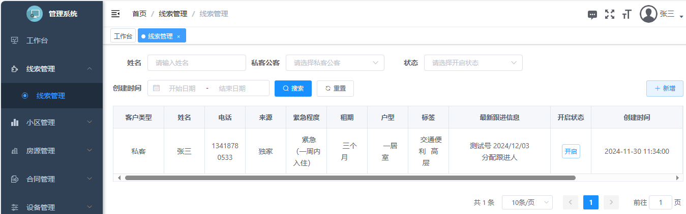
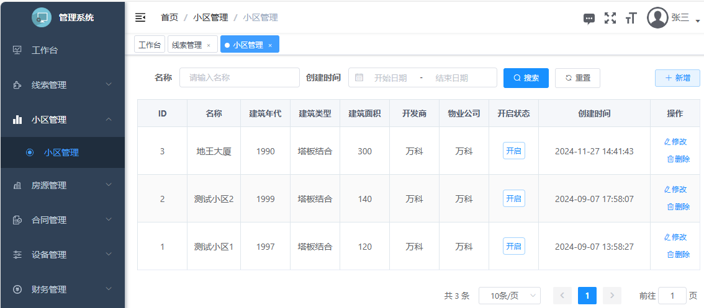
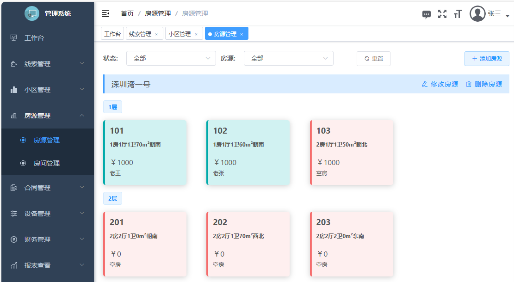
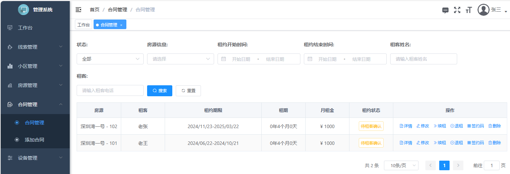
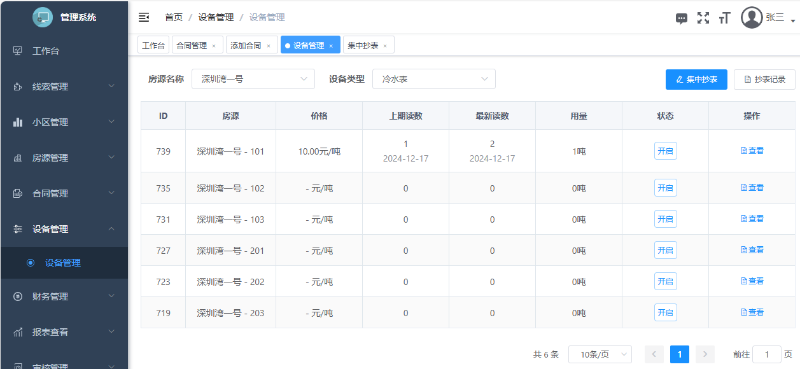
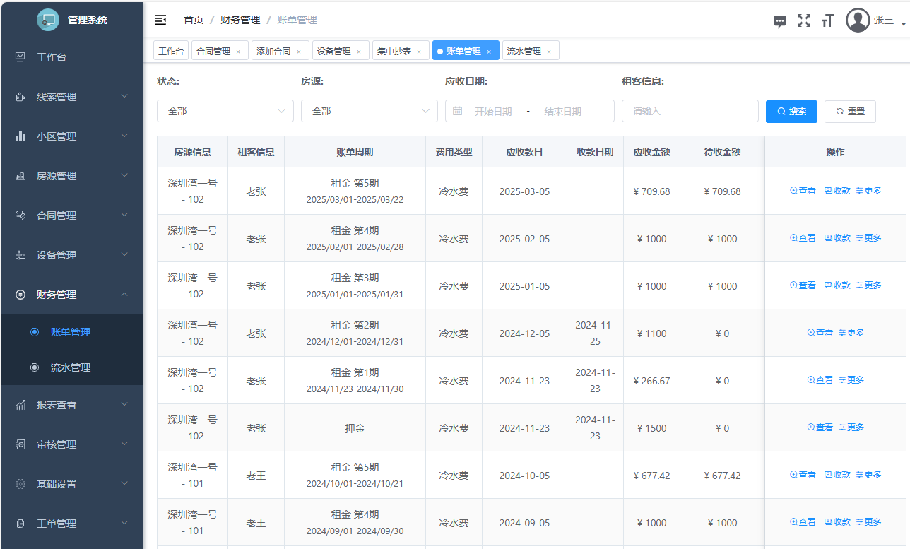
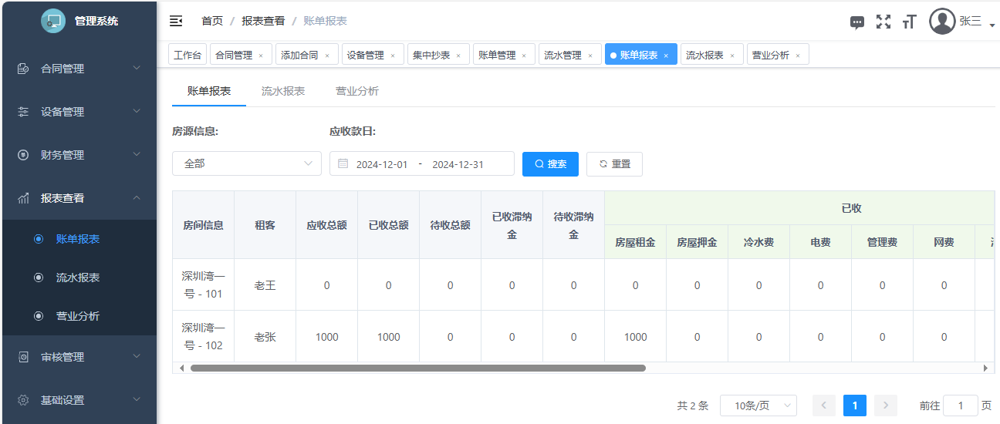

**可用于公寓管理、物业管理，目前已支持潜在客户管理系统，房源管理系统，合约管理系统，账务管理系统，租后管理，营销推广系统，智能设备管控系统，数据报表分析等九大核心模块，支持移动端/电脑端/小程序等多端联动，打破信息孤岛，实现移动化办公，开启智慧管理新时代。
  如果这个项目让你有所收获，记得 Star 关注哦，这对我是非常不错的鼓励与支持。** 
##  新手必读
* 帮助地址：<https://help.woju.vip>
* 演示地址：<https://demo.woju.vip> 账号：admin 密码：123456
* 小程序演示：微信搜索 我居租房
  

##  本地安装
 
### 第一步下载
* <https://help.woju.vip/install/download.html> 下载后解压到 D:\woju
* 

### 第二步启动mysql
* 双击start-mysql.bat 
### 第三步启动redis
* 双击start-redis.bat 
### 第四步启动server
* 双击start-server.bat
### 第五步启动web
* 双击start-web.bat
### 第六步进入后台管理
* 打开浏览器访问：http://127.0.0.1:8888 

## 功能介绍

### 线索管理
* 线索是指对潜在租客的基本信息和相关资料的记录，包括客户的联系方式、需求信息、购买意向等关键信息。这些线索可以来源于市场调研、网络营销、客户推荐等多种渠道，是企业获取潜在客户信息的重要桥梁和渠道，承载着发现和挖掘商机的重要任务。
*  
### 小区管理
* 小区是指以住宅为主并配套有相应公用设施及非住宅房屋的居住区、花园住宅、住宅组团。是指在城市一定区域内建筑的、具有相对独立居住环境的大片居民住宅，配有成套的生活服务设施，如商业网点、学校等。不限定人数。通常指城镇中，一条连续的围墙(含建筑物)封闭起来的一个独立完整的居民住宅区。常在房屋管理(含交易、物业管理)等场合下提起。物业管理处、业委会常以小区为单位配置。
*  
### 房源管理
* 房源是指可供出租的房产信息，是公寓运营的基础‌。这些信息通常包括房产的位置、面积、户型、租金、装修状况等关键细节，是租客做出租赁决策的重要依据。 房源管理功能涵盖了房源信息的全面录入、查询、修改和删除。管理者可以轻松录入每套房源的详细信息，如房屋位置、户型结构、面积大小、装修风格以及家具家电配备情况等，并上传高清图片和视频，全方位展示房源特色。系统还提供了强大的分类和搜索功能，支持按多种条件进行筛选查找，以便快速精准匹配租客需求。 此外，公寓管理系统还能实时更新房源状态，如已租、未租、即将到期等，帮助管理者快速掌握房源情况，减少空置率，提高运营效率‌。
*   
### 合同管理
* 租房合同，也称为租赁合同，详细规定了出租人（房东或房屋所有者）与承租人（租客）在房屋租赁过程中的权利和义务。
*  
### 设备管理
* 设备包括：智能电表、智能水表等，设备读数自动录入系统，不仅大大提高了抄表的准确性和效率，还减少了人工抄表的错误率和成本。
*  
### 财务管理
* 账单管理涵盖了租金、押金、维修费、保洁费等各类费用的收支情况。通过账单管理功能，公寓管理者可以清晰地掌握自己的财务状况，包括租客的收款账单和业主的付款账单等。此外，账单管理还涉及到在线支付、催缴通知、退款处理等多个环节，确保每一笔交易都能在系统留痕记录，提高公寓管理效率，节约人工成本‌账单管理涵盖了租金、押金、维修费、保洁费等各类费用的收支情况。通过账单管理功能，公寓管理者可以清晰地掌握自己的财务状况，包括租客的收款账单和业主的付款账单等。此外，账单管理还涉及到在线支付、催缴通知、退款处理等多个环节，确保每一笔交易都能在系统留痕记录，提高公寓管理效率，节约人工成本‌
*  
### 报表查看  
* 账单报表是指记录公寓运营中实际发生的收入和支出情况的报表，用于清晰地展示公寓的财务状况‌。

账单报表通常包括收付流水记录，这些记录反映了实际发生的收入和支出情况。只有实际发生的流水才会被系统结算为账单，而没有实际收支的账单则处于待租客支付状态。通过账单报表，公寓管理者可以清晰地掌握自己的财务状况，包括租客的收款账单和业主的付款账单等‌1。此外，公寓管理系统通常配有相关的财务功能模块，如租金收缴、流水统计、账单管理等，这些功能不仅简化了财务人员的工作流程，还在时效性和准确性上提供了优势‌
*  

## 合作交流
*  
 